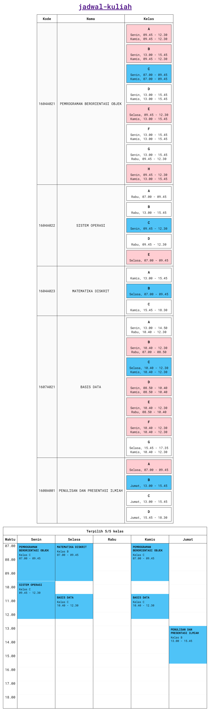

# jadwal-kuliah
Aplikasi menyusun jadwal kuliah dalam satu minggu.

## Cara menggunakan
1. Menyematkan [app.js](src/app.js) dan [app.css](src/app.css)
2. Membuat dua tabel (`<table>`) dengan atribut class masing-masing `tabel-mata-kuliah` dan `tabel-jadwal`
3. Membuat objek `JadwalKuliah` dengan masing-masing parameter adalah: elemen tabel dengan atribut class `tabel-mata-kuliah`, elemen tabel dengan atribut class `tabel-jadwal`, dan daftar mata kuliah dalam bentuk array dari objek mata kuliah (struktur objek ada di bawah)

#### Contoh:
```html
...
<link href="../src/app.css" rel="stylesheet" /> //menyematkan app.css
...
<table class="tabel-mata-kuliah" id="tabel-mata-kuliah"></table>
<table class="tabel-jadwal" id="tabel-jadwal"></table>
...
<script src="../src/app.js" type="application/javascript"></script> //menyematkan app.js
<script type="application/javascript">
    new JadwalKuliah(
        document.querySelector('#tabel-mata-kuliah'), //elemen tabel dengan atribut class tabel-mata-kuliah
        document.querySelector('#tabel-jadwal'), //elemen tabel dengan atribut class tabel-jadwal
        contohDaftarMataKuliah //array dari objek mata kuliah
    );
</script>
```

## Struktur objek mata kuliah
> Contoh dapat dilihat pada [demo/daftar-mata-kuliah.js](demo/daftar-mata-kuliah.js)
```javascript
{
  nama: 'MATEMATIKA DISKRIT', //String. Nama mata kuliah
  kode: '1604A023', //String. Kode mata kuliah
  kelas: [ //Array. (dari) objek kelas
    {
      kode: 'A', //String. Kode kelas
      jadwal: [ //Array. (dari) objek jadwal
        {
          hari: 'Kamis', //String. Nama hari, harus merupakan salah satu dari 'Senin', 'Selasa', 'Rabu', 'Kamis', 'Jumat', 'Sabtu', 'Minggu'
                         //Perhatikan bahwa nama hari Jumat tidak memiliki petik
          waktuMulai: '13.00', //String. Waktu mulai jadwal, harus dalam format HH:MM
          waktuBerakhir: '15.45' //String. Waktu berakhir jadwal, harus dalam format HH:MM
        }
      ]
    }
  ]
}
```

## Kustomisasi
Saat ini yang dapat dikustomisasi hanyalah variabel css dalam cakupan root (pseudo-class `root`). Berikut adalah variabel-variabel yang dimaksud:
|Nama variabel|Nilai standar|Deskripsi|
|:-:|:-:|:-|
|`border`|`1px solid #212121`|Ukuran, jenis dan warna batas pada sisi-sisi tabel|
|`tr-kelas-telah-dipilih-background-color`|`#fafafa`|Warna latar belakang baris tabel pada mata kuliah yang telah dipilih kelasnya|
|`kelas-background-color`|`#ffffff`|Warna latar belakang kotak kelas mata kuliah|
|`kelas-hover-background-color`|`#b3e5fc`|Warna latar belakang kotak kelas mata kuliah saat cursor melayang di atasnya (saat akan memilih kelas)|
|`kelas-dipilih-background-color`|`#4fc3f7`|Warna latar belakang kotak kelas mata kuliah yang telah dipilih|
|`kelas-dipilih-hover-background-color`|`#e57373`|Warna latar belakang kotak kelas mata kuliah yang telah dipilih saat cursor melayang di atasnya (saat akan membatalkan pilihan kelas)|
|`kelas-bertabrakan-background-color`|`#ffcdd2`|Warna latar belakang kotak kelas mata kuliah yang jadwalnya bertabrakan dengan kelas lain|
|`daftar-kelas-bertabrakan-background-color`|`#f44336`|Warna latar belakang daftar mata kuliah yang jadwalnya bertabrakan|
|`kelas-bertabrakan-color`|`#212121`|Warna latar depan (warna teks) pada kotak kelas mata kuliah yang jadwalnya bertabrakan dengan kelas lain|
|`tabel-jadwal-border-color`|`#f5f5f5`|Warna batas sisi transparan pada tabel jadwal|
|`jadwal-background-color`|`#4fc3f7`|Warna latar belakang jadwal mata kuliah pada tabel jadwal|

## Demo
[demo.html](demo/demo.html)

## Screenshot


---
Menggunakan [lisensi MIT](LICENSE)
